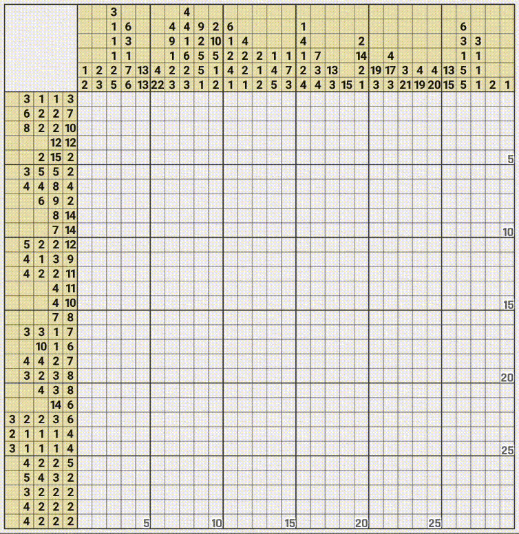
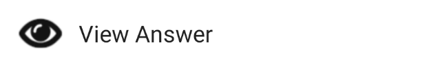

# Nonogram solver

<p align="center">

</p>

## Info
This is a high-performance grid auto-filling engine written in C++ for [Nonograms Katana](https://play.google.com/store/apps/details?id=com.ucdevs.jcross&hl=en) application.

> [!WARNING]
> This project is an independent experiment and is not affiliated with
or endorsed by the original application developers.
Please use responsibly and respect the game's intended experience.

Currently, the project does not implement an actual logical "solver" functionality. Instead, it parses an already-available solution state and applies it to the grid with minimal latency.

Future work may include implementing a full constraint-based solving algorithm.

> [!note]
> Works only on Android devices.

Now works with colored nonograms as well!

<p align="center">

</p>

## Usage
Connect your Android device to the PC. Developer settings should be enabled on the device and USB Debugging should be allowed.

The program works in 3 modes: capturing, painting and combination of both (capturing + painting).

### Capturing
In capturing mode the program parses the answer from the screen. To get the answer to the nonogram find the "View Answer" button.

<p align="center">

</p>

After clicking it the answer will pop up. Click it once more to go into full screen.

Then run program with `-c` or `--capture` option.

Example:

```shell
./solver 30 15 -c -o
```

In this example the specified command arguments are:
- `30` - width of the nonogram puzzle
- `15` - height of the nonogram puzzle
- `-c` - option that specifies capturing mode
- `-o` or `--colored` - indicates that the nonogram is colored. When this option is ommited, the puzzle is treated as black and white nonogram.

The answer will be parsed and saved locally on your PC. You can check it in *bitmap.bmp* file.

### Painting
In painting mode the grid is rapidly filled with the answer which hopefully was parsed during the capturing step.

The grid should be in the initial state as if you've just opened the nonogram. Do not drag or zoom it.

Run program with the `-p` or `--paint` option.

```shell
./solver 30 15 -p -o
```

### Multimode
Multimode is a combination of capturing and painting, made for convenience. It can be enabled by specifying both `-c` and `-p` or by ommiting them at all.

The prerequisites before running the program in this mode are the same as for capturing mode. Again, before viewing the result make sure that you did not drag or zoom the nonogram grid.

Example:

```shell
./solver 30 30 -o
```

And for black and white puzzles simply:

```shell
./solver 20 30
```

## Build

There is no release builds. If you're interested in usage, you can build it with CMake.

```shell
mkdir build
cd build
cmake ..
make
```

### Dependencies

- ADB. The path to `adb` executable should be in your `PATH`.
- OpenCV libraries.

### Third party libraries

This project also uses:

- **cxxopts** for parsing command line arguments.
- **scrcpy** manual server for communicating with the device and sending taps in quick succession (because default `adb shell input` is notoriously slow).
- **asio** for communicating with scrcpy server.
- **subprocess.h** for creating subprocess with the server.
